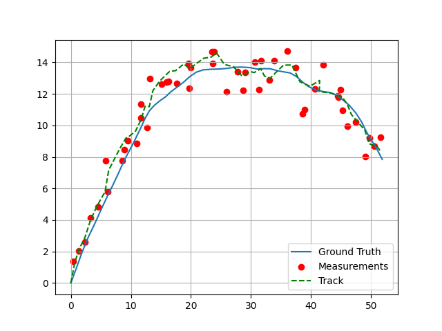

# MOTpy

Modular Python library for multi-object tracking (MOT) algorithm development.

## Library Components

MOTpy currently includes the components below. 

- Kalman Filters:
  - Linear Kalman Filter
  - Unscented Kalman Filter
- Data association:
  - Statistical measurement gating
  - Jonker-Volgenant assignment algorithm
- Multi-object trackers:
  - Track-oriented Multi-Bernoulli/Poisson (TOMB/P) filter
- Transition models:
  - Nearly constant velocity (NCV)
  - Coordinated Turn (CT)
- Measurement models:
  - Linear
  - 2d radar (range/azimuth/bearing)
- Gaussian density manipulation (mixture reduction, merging, pruning)
- GOSPA metrics

## Example Usage

The `tests/` subdirectory provides example usages for most library components. The code snippet below demonstrates a simple single-object tracking scenario using a Kalman filter. 

```python
from motpy.estimators.kalman import KalmanFilter
from motpy.distributions.gaussian import Gaussian
from motpy.models.measurement import LinearMeasurementModel
from motpy.models.transition import ConstantVelocity
import numpy as np
import matplotlib.pyplot as plt

rng = np.random.default_rng(0)

##################
# Define models
###################
transition_model = ConstantVelocity(
    state_dim=4,
    position_inds=[0, 2],
    velocity_inds=[1, 3],
    noise_type='continuous',
    w=0.01,
)
measurement_model = LinearMeasurementModel(
    state_dim=4,
    measured_dims=[0, 2],
    covar=np.diag([1, 1])**2,
)

##################
# Simulate data
###################
init_state = np.array([0, 1, 0, 1])
ground_truth = [init_state]
measurements = []
for _ in range(50):
  current_state = ground_truth[-1]
  next_state = transition_model(current_state, dt=1.0, noise=True, rng=rng)
  ground_truth.append(next_state)

  z = measurement_model(next_state, noise=True, rng=rng)
  measurements.append(z)

####################
# Run Kalman Filter
####################
kf = KalmanFilter(
    transition_model=transition_model,
    measurement_model=measurement_model,
)
init_track_state = Gaussian(
    mean=init_state,
    covar=np.diag([1, 1, 1, 1])**2,
)
track_history = [init_track_state]
for z in measurements:
  current_state = track_history[-1]
  predicted_state = kf.predict(current_state, dt=1.0)
  posterior_state = kf.update(predicted_state, z)
  track_history.append(posterior_state)

################
# Plot results
################
track = np.array([state.mean for state in track_history])
ground_truth = np.array(ground_truth)
measurements = np.array(measurements)
plt.plot(ground_truth[:, 0], ground_truth[:, 2], label='Ground Truth')
plt.scatter(measurements[:, 0], measurements[:, 1],
            color='r', label='Measurements')
track = np.array([state.mean for state in track_history])
plt.plot(track[:, 0], track[:, 2], label='Track',
         linestyle='--', color='green')
plt.legend()
plt.grid()
```

The result should look something like this:



## Installation

You can install MOTpy via pip:

```bash
pip install -e .
```
